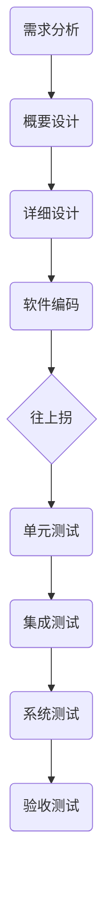

课程地址: https://www.imooc.com/learn/700

# 软件测试基础—概念篇

## 第1章 课程介绍

### 1-1 软件测试概要

课程目标

了解软件测试的含义

* 软件测试遵循的准则
* 软件测试有哪些分类，分别是什么概念

* 何时开始测试？测试方案如何设计？
* 测试流程是怎样的？怎么提bug？怎么写报告？
* 为什么要做自动化？怎么做？

软件测试的历史

什么是软件测试

早期定义

​    软件测试是对程序能够按预期运行建立起一种信心

经典定义

​    测试是为了发现错误而执行程序的过程

IEEE定义（ISO 29119）

​    使用人工或自动的<u>**手段**</u>来运行或测量软件系统的过程，以检验软件系统是否满足**<u>规定的要求</u>**，并找出与**<u>预期结果</u>**之间的差异

 

软件测试的测试对象

软件测试 = 程序测试？

软件测试的测试对象

* 软件需求
* 软件概要设计
* 软件详细设计
* 软件运行环境
* 可运行程序
* 软件源代码

五大要素和两个目标

质量---->人员

测试覆盖率------> 测试效率

资源        流程         技术

软件测试所遵循的原则

1. 测试显示缺陷的存在，但不能证明系统不存在缺陷
2. 穷尽测试是不可能的，应设定及时终止的条件
3. 测试应该尽早进行
4. 缺陷具备群集特性
5. 测试的杀虫剂悖论
6. 测试的二八原则
7. 测试活动依赖于测试背景

## 第2章 软件测试阶段、手段和模式

### 2-1 软件测试阶段

我们可以从多个不同的维度来对软件测试进行分类.我们可以按照测试所在的不同阶段来对软件测试进行分类,也可以按照测试时所采用的手段对软件测试进行区分,还可以按照测试遵循的测试模式进行分类,软件测试还包括各种各样不同的测试类型,依据测试类型也可以对软件测试进行分类.

#### 按测试阶段来分类

依据软件工程学的不同阶段,我们可以对软件测试分成:

* 单元测试
* 集成测试
* 系统测试
* 验收测试

#### 单元测试

> 什么是单元测试?

​			单元测试就是对软件中的==最小可测试单元==进行检查和验证.

其中==单元==的概念需要根据不同的情况来看: 像C语言, 单元我们可以看成C语言中的各个函数;像Java这种面相对象的语言, 单元可以看成是每一个类; 针对一些有界面的功能软件,单元也可以看成具体的功能项,比如一个菜单项,一个子窗口的具体的功能.总之,==单元就是人为规定的可测试的最小模块==.

##### 单元测试的原则

单元测试一般都是针对代码的测试,在单元测试中有一些原则需要遵循:

1. **<u>尽可能保证各个测试用例是互相独立的</u>**

   就是我们应该避免在一个写的测试脚本中/测试类中调用其他依赖的类

   例: 一个测试登录的测试脚本,两个参数:用户名,密码来测试login这个方法的功能:

   ```java
   public void testlogin(){
       String username, password;
       username = 'test';
       password = getpassFromDB(username);
       Boolean result = app.login(username,password);
       assertTrue(result);
   }
   ```

   其中用到了`getpassFromDB()`方法, 这是错误的做法. 

   <u>错误的原因:</u>

   ​	  因为在测试方法中调用了其他的依赖的类, 这会导致如果测试用例失败时很难判断是被测方法`login`出了问题还是调用的依赖方法`getpassFromDB`出了问题,所以写单元测试的时候应该尽量避免使用依赖方法.

   <u>正确的方法应该是:</u>

   ​	  编写一个模拟的方法来取代使用外部的依赖,对于这些必须验证的依赖关系,我们可以放到后面的集成测试中来做,这样我们才能保证有一个易维护、高质量的单元测试.

2. <u>**一般由被测代码的开发人员来实施,用以检验所开发的代码功能符合自己的设计要求**</u>

   现在的敏捷研发还强调有结对编程,那也可以由结对的编程人员来做单元测试.总之,实施单元测试的人需要对被测试的模块代码有相当程度的了解,这也是单元测试的一个原则.

##### 单元测试的益处

在软件测试的不同阶段中,单元测试是一个非常重要的阶段,是其他阶段测试地基础.原因:

1. **能尽早发现缺陷**

   ​      通过单元测试能尽早地发现缺陷.在前面的课程里我们提到过关于缺陷和研发周期关系的曲线,并得出结论:<u>==测试应该尽早进行==</u>.在测试前期能发现更多的缺陷而且收益是最高的.而单元测试在整个研发中是处于前期的阶段,所以这个阶段的投入收益是非常好的.现代的敏捷研发还强调TDD(测试驱动开发),就是先编写单元测试,再编写功能代码并保证这些代码能够使单元测试用例通过,这不仅仅保证写出来的代码经过充分必要的单元测试,而且在编写单元测试的时候也是对需求设计的二次确认和理解的过程,这样就保证在开发的时候对需求设计有清晰的理解

2. **有利于重构**

   ​      通过实施单元测试有利于我们以后的重构.软件产品不变的就是变化,重构总是存在,如果我们进行了完善的单元测试就能最大限度的保证后面的重构后的软件的正确性.有了完善的单元测试,在重构时就可以快速识别出重构时出现问题的点

3. **简化集成**

   ​      通过单元测试保证了最小单元模块的稳定性和正确性,这就为后面的集成测试奠定了基础.只有充分进行了单元测试,集成测试才能更加聚焦到模块之间的关系上,而不用再花很多精力到单元内部逻辑的验证上

4. **文档**

   ​      现代的敏捷研发提倡“代码即文档”,就是尽可能的减少我们的文档,因为代码总是在不断变化,经常需要修改,如果还同步维护一份文档,修改代码也意味着文档的修改,会使工作量成倍提高,单元测试包含了对模块功能的基本理解和特性,如果单元测试比较规范,通过对单元测试代码的阅读,就可以基本理解模块功能的特性,所以就很大程度上减少文档的存在

5. **用于设计**

   ​      通过编写单元测试我们可以把设计思路体现在单元测试的组织中.而且相对于UML基于图形的设计方法,==单元测试的最大优点是设计本身是可以用来验证设计的==

##### 单元测试的限制

1. **不可能覆盖所有的执行路径,所以不可能保证捕捉到所有路径的错误**

   这在我们前面课程中提到的==软件测试的第一条原则:<u>软件测试不可能发现所有的缺陷</u>==,所以单元测试也不可能覆盖所有的执行路径并且捕捉到所有的错误

2. **每一行功能代码,一般需要3~5行测试代码才能完成单元测试,所以存在投入和产出的平衡**

   每一行功能代码,一般需要3~5行测试代码才能完成单元测试->这是一个*<u>经验数据</u>*,从这个数据我们可以看出,单元测试的投入是非常大的,所以我们需要在投入和产出之间寻找一个平衡,前面课程里面我们也提到软件测试有一个原则叫==<u>穷尽测试是不可能的</u>==,所以我们在单元测试实施的时候需要找到一个最佳性价比使我们的投入和产出在一个平衡点

##### 单元测试框架

单元测试因为是对代码进行测试所以有各种各样的单元测试框架,最典型的就是各种各样xUnit的测试框架:

JUnit(针对Java的)、PHPUnit、nunit(针对.net的)、CPPUnit等等

以JUnit为例来说明单元测试是如何执行和实施的

#### 集成测试

##### 定义

​		是==在单元测试的基础上==,测试在将所有的软件单元按照概要设计规格说明的要求==组装==成模块、子系统或系统的过程中各部分工作是否达到或实现相应技术指标及要求的活动

简单理解:集成测试是在单元测试完成的基础上针对已经完成单元测试的模块,并把他们组装成更高一级的模块和子系统,针对这些子系统进行的集成.它的测试对象是:各个已经经过单元测试的单元模块之间的接口

##### 集成测试的主要实施方案

1. Big Bang

   ​	  也叫一次性集成,或者大爆炸. 它的做法主要是把大部分的开发模块都耦合起来形成一个完整的软件系统和系统的主要组成部分,并把它们拿来做集成测试.就是所有的东西全部都组装好,然后再来一起做测试

2. 自顶向下

   ​	  这是一个递增的组装软件结构的方法,一般来说从主程序开始,沿控制层逐层逐层向下集成,然后通过这种方式逐层的来测试,覆盖到所有的模块,这样的一种实施方式我们称为自顶向下

3. 自底向上

   ​	  一般是最常用的集成方法.其他的集成方法或多或少都会继承或吸收这种集成方式.它是从程序模块的最底层的模块开始逐层向上组装并逐层的测试, 它的好处是,针对我们已经集成的,已经组装过的测试,所以不需要再针对上一层编写桩模块[^1],就是模拟真实的模块的一些动作,所以它也是最常用的集成的方法.它的优点:能够比较好的锁定软件故障的所在位置

4. 核心系统集成

   ​	  先把核心的软件部分挑选出来并对这些部件进行集成测试,在测试通过的基础上再逐步扩展到外围的一些部件,直到最后形成稳定的软件产品

5. 高频集成

   ​	  指的是同步于软件开发过程,每隔一段时间开发团队就对现有的代码进行一次集成测试.在现代的软件研发中,持续集成就是高频次的,不断的进行集成测试

核心系统集成和高频集成的结合, 一般是现在敏捷研发比较常用的一种集成方式;自顶向下/自底向上在传统的瀑布式软件研发模式中是比较常用的

##### 与单元测试的区别

1. 测试对象不同

   ​	  单元测试:针对软件基本的单元,最小的单元进行的测试

   ​	  集成测试是以模块和子系统为单元进行测试,主要测试的是模块和模块之间接口的关系

2. 测试的依据不同

   ​	  单元测试主要针对软件的详细设计来做测试,测试用例的主要设计依据是详细设计文档

   ​	  集成测试是针对软件概要设计来做测试,测试用例的主要依据是概要

3. 测试的方法不同

   ​	  集成测试关注的是接口之间的集成,就是模块之间接口的集成,而单元测试只关心在单元的内部,所以在测试方法上它们也是有一定区别的

#### 系统测试

##### 定义

​	  是将经过集成测试的软件,作为计算机系统的一个部分,==与系统中其他部分结合==起来,在==实际运行环境下==对计算机系统进行的一系列严格有效地测试,以发现软件潜在的问题,保证系统的正常运行

> ​	  就是系统测试是在集成测试的基础上,把它作为整个计算机系统的一个部分,与系统中其他部分结合起来来运行.集成测试、单元测试我们很多地方都会采用模拟的方式来做,而系统测试更多的是用真实的运行环境来系统的对软件进行测试,系统测试一般需要做功能测试、性能测试、稳定性测试等多种测试类型的测试.如果企业中有专职的测试岗位的话所针对的一般来说就是针对系统测试的阶段.

##### 关注点

* 关注系统本身的使用
* 关注系统与其他相关系统间的连通
* 关注系统在不同压力下的表现
* 关注系统在真实使用环境下的表现

##### 和集成测试的区别

系统测试和集成测试往往因为测试对象有些相似,在实际研发中这两者有时候容易混在一起,但二者是有明显区别的

* 测试对象
  * 集成测试: 由通过了单元测试的各个模块所集成起来的构件
  * 系统测试: 除了软件之外,还包括计算机硬件及相关的外围设备、数据采集和传输机构、支持软件、系统操作人员等整个系统
* 测试时间
  * 集成测试: 介于单元测试和系统测试之间的测试
  * 系统测试: 在集成测试之后

* 测试内容
  * 集成测试: 各个单元模块之间的接口
  * 系统测试: 整个系统的功能和性能
* 测试角度
  * 集成测试: 偏于技术角度的验证
  * 系统测试: 偏于业务角度的验证

#### 验收测试

##### 定义

​	  也称交付测试.针对用户需求、业务流程的正式的测试,确定系统是否满足验收标准,由用户、客户或其他授权机构决定是否接受系统

> 是一种比较正式的测试,它的目的是由用户来决定是否接受系统的功能,或者说这个系统是否可以交付

##### 细分

* 用户验收测试

  ​	  一般由开发方在移交产品前来运行的测试,测试的执行人还是开发方,在把产品交付给客户之前自己来做的一种测试这个称之为用户验收测试

* 运行验收测试

  ​	  更多是从运维层面来看系统是不是可以被正常运行和维护的.比如系统上线后它的备份、容灾和灾难恢复这样的一些场景是不是正确

* 合同和规范验收测试

  ​	  主要是参照约定的规范进行验收,而且一般这里面还会针对政府和法律法规的合规进行验证

* alpha测试

  ​	  在开发者所提供的场所或环境中来运行,一般是由用户来执行,但是场所和环境是由开发者提供的,这种测试称之为alpha 测试

* beta测试

  ​	  完全脱离开发者环境,在用户提供的场所或环境下来进行测试,这叫做beta 测试.

alpha版本:产品开发完了,但是这个版本目前是在开发者环境上供大家使用来验证的,

beta版本:是已经脱离了开发者,完全是在用户的环境上给大家来验证

release版本:就是正式的可供交付的版本

以上是一般意义上理解的验收测试,在现代的敏捷研发理论里面,还有一种验收测试的概念,叫<u>验收测试驱动开发</u>,它是测试驱动开发的一个延伸,也有叫做BDD(行为驱动开发),这两个概念基本类似.就是说,在写开发代码前先定义好敏捷里的用户故事,针对这个用户故事的验收条件,然后再开发功能代码,保证我们的功能代码能够满足验收测试的条件,这样一种研发模式也称为ATDD(验收测试驱动开发),这是验收测试在敏捷研发中的一个应用

#### 总结

按不同的测试阶段来对软件测试进行区分的话:

​	  单元测试:是各个阶段测试的基础,它测试的对象是最小的可测试单元

​	  集成测试:关注的是各个最小单元模块之间的接口,和子系统的集成

​	  系统测试:则是把整个系统组装以后置于真实的运行环境,对系统进行全面的评估

​	  验收测试:更强调的是从用户的角度对系统/软件的认可的验收

### 2-2 软件测试手段

按照测试时对象的可见度,我们可以分成:黑盒测试、白盒测试

根据状态,我们可以分成:静态测试、动态测试

根据测试执行的方式,我们还可以分成:手工测试、自动化测试

可以看到在不同的测试手段下,相应的测试概念也是一一对应,黑白分明,一静一动,是对称的

#### 黑盒测试

##### 定义

​	  就是在测试中把被测系统或软件看成一个不能打开的盒子.在完全不考虑程序内部结构和内部特性的情况下,通过相关暴露出的接口来对程序进行测试.

黑盒测试只检查程序的功能是否能按照需求规格说明的规定正常使用,程序是否能适当地接受输入数据,并产生正确的输出信息.黑盒测试着眼于程序的外部结构,不考虑内部的逻辑.一般来说,针对软件外面的界面或可见的功能来进行测试.做黑盒测试更多的是从用户的视角,通过不同的数据和事件来驱动系统,并通过输出结果来进行判断.

从黑盒测试的定义上,黑盒有比较大的优点

##### 黑盒测试的优缺点

###### 优点

1. 容易实施,不需要关注内部的实现
2. 更贴近用户的使用角度

###### 缺点

1. 测试覆盖率较低,一般只能覆盖到代码量的不到40%

2. 针对黑盒的自动化测试,复用率较低,维护成本较高

   黑盒测试一般来说最关注的是功能,软件产品在研发迭代的过程中最经常变化的就是功能,所以特别是界面的UI类产品,或者说互联网产品会有非常频繁的变化, 今天搞个活动,明天来个升级,变化非常快.所以针对功能来做自动化测试的测试用例重复利用率相对来说比较低,而且因为经常变,脚本的维护代价相对比较大,这个是黑盒测试比较明显的缺点

##### 黑盒测试主要测试什么?

> 是否有不正确或遗漏的功能?

​		拿到一个软件产品做黑盒测试,重点是关注软件的实现上有没有实现的不正确或者没有实现的功能

> 在接口上,输入是否能正确的接受?能够输出正确的结果?

​		就是从输入到输出,经过系统处理以后是否能满足预期的要求

> 是否有数据结构错误或外部信息(例如数据文件)访问错误?

​		关注系统在对数据的处理和访问上有没有什么问题

> 性能上是否能够满足要求?

​		系统的性能是黑盒测试重要的方面,在前面提到的测试阶段中系统测试阶段是比较多用到黑盒测试的(系统测试阶段主要用黑盒测试并不代表其他测试阶段就不做黑盒测试了,黑盒测试只是一种手段,在各个阶段都可以应用,但是一般来说在系统测试阶段我们会更多的借助黑盒测试来实施软件测试).

##### 黑盒测试主要的设计方法

>等价类划分法

​      针对程序有很多的输入条件,等价类划分就是把所有的输入当中等价的归成一类,这样最后会形成若干典型的代表性的输入.通过这些典型的数据进行测试用例的设计,这样一种方法我们叫<u>等价类划分法</u>

> 边界值分析法

​      是一种特殊的等价类划分,关注的是各种各样的边界条件,比如数据的区间(开区间、闭区间)这样的边界点.边界值分析之所以重要的原因是开发人员在编写程序的时候边界值是很容易出现失误的地方,比边界高一点、小一点或等于边界的时候在写代码的时候经常会犯这样或那样的错误,所以边界的情况需要我们重点关注

> 错误推测法

​      是基于经验或直觉来判断程序中可能出现错误的地方从而针对性设计测试用例的方法.比如界面输入的时候要考虑特殊字符的处理,在处理文件的时候要考虑文件不存在、文件超大这样一些特殊的情况

> 因果图法

​      我们拿到程序的需求规格说明书,针对每一种输入和输出(在因果图里会把输入和输出看作原因和结果),对输入和输出赋以特定的标识符,然后将这些情况形成因果图,最终根据规格的语意说明形成判定表,根据判定表来编写测试用例,这样的方法叫因果图法

> 正交试验分析法

​      通过正交性从一组数据中筛选出典型的代表性数据的设计方法.这种方法主要用来筛选输入数据,然后再来设计测试用例的输入输出.

> 状态迁移图法

​      通过梳理软件功能点里的状态迁移关系来设计测试用例.状态迁移比如审批的功能,提交审批到待审批的状态,审批又有拒绝、通过、退回这样一些状态,退回到提交者又会修改再重新提交,然后审批通过,这样各种各样的状态,通过这些状态画出他们之间变迁的关系图来设计测试用例的方法叫状态迁移图法

> 流程分析法

​      通过梳理程序的 逻辑执行路径来设计测试用例,这样的测试方法叫流程分析法

#### 白盒测试

黑盒测试内部是不可见的,白盒测试当然,测试人员对内部的结构是非常了解的,它的逻辑的结构对测试人员来说是透明的,所以白盒测试又称为结构化测试/透明盒测试.白盒测试是针对程序的逻辑结构来设计测试用例,用逻辑的覆盖率来衡量测试的完整性

##### 主要的逻辑单位

* 语句

  语句覆盖指的是测试用例设计出来执行以后会保证程序的每条语句至少执行一次

* 条件

  条件覆盖就是覆盖到条件的表达式,所有的表达式都至少计算一次

* 条件组合

  就是覆盖所有各种不同条件的组合情况

* 分支

  分支覆盖/判定覆盖就保证每个分支至少执行一次

* 路径

  路径覆盖是指程序中每一条可能的路径会至少执行一次,分支其实是路径的一部分

##### 白盒测试的优缺点

###### 优点:

1. 迫使测试人员去仔细思考软件的实现,理解原理
2. 可以检测代码中的每条分支和路径
3. 揭示隐藏在代码中的错误
4. 对代码的测试比较彻底

###### 缺点:

1. 昂贵

   因为白盒测试要做到较高的覆盖率,是从覆盖来判断测试的完整性.要做到较高的覆盖,工作量是非常大的(前面说了有那么多种覆盖的情况要考虑),所以做白盒测试成本是非常高的

2. 无法检测代码中遗漏的路径和数据敏感性错误

    覆盖做地很充分的话可以做到都覆盖,但是如果代码本身就少写了一些逻辑,这个通过白盒测试是无法检测的;还有一些对数据敏感性的错误,数据处理的有问题,这种错误通过白盒测试很难发现

3. 不能直接验证需求的正确性

   因为白盒测试是针对代码来的,而不是直接针对需求,所以不能直接验证需求规格的正确性,它是从代码层面来进行验证

##### 主要测试方法

1. 代码检测法

   主要包括桌面检查、代码审查和走查这样一些方法,主要是检查代码和设计的一致性,对代码本身进行检查

2. 静态结构分析法

   测试者通过使用测试工具来分析源代码的数据结构、内部的控制逻辑,通过这样的内部结构分析,来设计测试用例,这叫静态结构分析法

3. 静态质量度量法

   是根据标准的质量模型(比如ISO的一些质量标准)来作为基础,然后来构造质量的度量模型用于评估软件的各个方面的要素,这是静态质量度量法

4. 逻辑覆盖法

   就是前面介绍的6种主要的逻辑覆盖:语句覆盖,条件覆盖,条件组合覆盖,分支覆盖(判定覆盖),路径覆盖以及条件和判定的组合覆盖总共6种逻辑覆盖来对代码进行覆盖测试

5. 基本路径测试法

   是白盒测试里非常主要的一种测试方法,它是在程序控制流图的基础上通过分析控制构造的圈复杂度导出基本可执行路径的集合,进而设计测试用例的方法叫基本路径测试法

   所谓程序的控制流图就是描述程序控制流的一种图示方法

#### 灰盒测试

##### 定义

​	  介于黑、白盒测试之间的,关注输出对于输入的正确性,同时也关注内部表现

就是结合了白盒测试和黑盒测试的相关要素,更多的是在系统组件这一层来评价应用软件的设计符合需求的情况

#### 静态测试

##### 定义

​	  指==无须执行==被测程序,而是通过评审软件文档或代码、度量程序静态复杂度,检查软件是否符合编程标准,借以发现编写的程序的不足之处,减少错误出现的概率

> 静态测试的特点:
>
> ​	  程序是不被运行的,直接来看文档或代码,可以通过人工来做,也可以通过一些自动化工具,通过静态地检查代码或文档来发现程序的不足,这样的一种测试手段称之为静态测试

##### 方式

* 互审

  ​	  就是程序员相互检查对方的代码

* 走查

  ​	  一个小组集体来走查程序或文档

* 会议

  ​	  大家召开一个正式的会议,并有相应的记录、纪要和并对结果而输出结果的文档

  从互审到召开会议是**<u>从不正式到正式</u>**的一个区别

#### 动态测试

##### 定义

​	  通过运行被测程序,检查运行结果与预期结果的差异,并分析运行效率,正确性和健壮性等

> 之前介绍的黑盒测试和白盒测试里面都有一些测试设计方法,其中黑盒测试相关的一些方法主要是动态测试的一些方法,白盒测试里像代码检查法,静态结构分析法这样一些方法就是典型的静态测试的方法

例:生活中买车的例子

​		  看看车的外观,车漆有没有划伤,看看轮胎胎压足不足,打开引擎盖抽出油尺看看油量是否正常,这是**静态测试**

​		  把汽车发动起来听听发动机的引擎声音,然后把汽车开到路上,感受汽车乘坐的舒适度,汽车的可操控性怎么样,这是**动态测试**


从测试执行的方式上我们还可以把测试分成手工测试和自动化测试

#### 手工测试

##### 定义

​	  由专门的测试人员从用户视角来验证软件是否满足设计要求的行为,更适用针对深度的测试和强调主观判断的测试

##### 测试方法

* 众包测试
* 探索式测试

#### 自动化测试

##### 定义

​	  使用单独的测试工具软件控制测试的自动化执行以及对预期和结果进行自动检查

> 自动化测试强调利用第三方的测试工具来控制测试自动的执行,还要对预期和结果进行检查

单元测试、接口测试、性能测试等更多的是利用自动化这种手段

#### 手工测试vs自动化测试

##### 手工测试

* 易发现缺陷

  因为人的创造性和主观性更容易发现软件中的问题

* 容易实施

  只要环境具备,完成了测试设计,人员到位,就可以开始手工测试

* 创造性、灵活性

  因为人的因素,手工测试更具具有创造性和灵活性

* 覆盖量化难

  人对测试做到什么程度这个很难量化,这个测试完了测试覆盖率大概能达到多少也很难量化

* 重复测试效率低

  同样的测试用例如果需要反复执行,人来做这个事情就得按部就班一步步来做,效率非常低

* 不一致性、可靠性低

  同样的测试用例、同样的人来做两次,它的过程也不可能是一样的,所以存在前后的不一致性、可靠性较低

* 人力资源依赖

  测试效果更依赖人的水平,人的能力

##### 自动化测试

* 高效率、速度快

  ​	  机器来执行,同样的一条用例,自动化来做,程序跑起来,效率很高,速度也比人来做会快一些

* 高复用性

  ​	  一条用例用自动化实现了,只要这个用例的场景没有变,那这个用例是可以重复执行很多遍的,执行过程是不会有任何变化的

* 覆盖率容易度量

  ​	  自动化针对哪些功能,做没做,执行完了都是有记录的,所以覆盖率非常容易度量出来

* 准确、可靠

  ​	  机器来执行,纯粹的机器指令,第一次和第二次只要脚本是一样的执行的过程就不会有区别,准确可靠

* 不知疲劳

  ​	  机器、工具不会像人容易出现疲劳的问题

* 机械、发现缺陷率低

  ​	  因为机器不具备创造性,不灵活;发现缺陷率低:自动化测试不太容易发现缺陷,因为机器不具备创造性

* 一次性投入较大

  ​	  从实施自动化测试之初,从测试工具的选型,框架的设计,到自动化测试脚本的编写、维护,都需要投入比较大的精力和资源来做这个事情,这是自动化测试的限制

从手工测试和自动化测试的比较我们可以看到:

​	  手工测试和自动化测试各有他们的适用场景,我们需要针对我们测试的要求,灵活地选择我们是使用手工测试还是自动化测试来做测试

#### 回顾

按照测试手段来细分软件测试:

1. 黑盒测试

   ​	  指的是把测试的对象看成一个黑盒,不了解内部的逻辑和结构,从用户的角度来对软件进行测试的方法

2. 白盒测试

   ​	  测试人员是完全了解内部的结构和设计逻辑的,通过逻辑的覆盖来保证测试的的完整性

3. 静态测试

   ​	  指的是我们不运行我们的被测软件,通过静态地检查代码和文档来进行测试

4. 动态测试

   ​	  把软件运行起来,通过运行的表现来判断软件运行的功能是否正常

5. 手工测试

   ​	  是由专门的测试人员根据测试用例来实施的测试

6. 自动化测试

   ​	  借助第三方的测试工具来自动化地运行和检查我们的测试,手工测试和自动化测试各有他们的适用场景

### 2-3 软件测试模式

##### 按测试模式来对软件测试进行分类

正如软件开发过程中有着各种各样的开发模型,软件测试也是有测试相关的模型和测试模式,比如:

​	  瀑布模型、敏捷测试、基于脚本的测试、基于风险的测试、探索式测试等

##### 传统的瀑布模型


这个模型其实是传统的软件工程学的瀑布开发模式,这也是最早出现的软件开发模型,在软件工程中有着重要的地位,瀑布模型从项目计划到集成维护,每个阶段都是按顺序的向下流动到下一个阶段,就像瀑布下落一样,这也是这个模型名称的由来.瀑布模型每个阶段都是以上个阶段的输出作为下个阶段的输入.

具体来看每个阶段

> 项目计划

​        主要是制定项目的总体的研发计划,确定主要的里程碑节点,这个阶段需要输出项目计划书

> 需求分析

​		会明确用户的需求定义,并对这个定义进行清晰的描述,是充分理解客户需求、描述产品功能的重要阶段,这个阶段会输出产品的需求规格说明

> 软件设计

​		会根据需求的定义来确定产品实现的方案,包括定义软件/硬件的结构,组建模块的实现方法,接口、界面、数据如何进行组织,这个阶段会输出包括概要设计、详细设计在内的多份设计说明书

> 程序开发

​		这个阶段是由开发团队来根据需求和设计具体地实现产品,来根据编程规范构建各类的组件模块,最后输出产品版本

> 软件测试

​		通过独立的测试小组或QA团队来评估产品是否满足需求的定义,最后输出测试结果、测试报告

> 集成维护

​		则是产品经过测试以后交付给用户,根据用户的使用情况对产品进行维护及必要的修改、升级这样的一些操作

###### 瀑布模型的优缺点

**优点**

* <u>强调需求、设计的作用</u>

  ​	  需求分析和软件的设计在瀑布模型中占有很大的比重,这就保证了我们对用户的需求能有一个比较充分的了解

* <u>前一阶段完成后,只需关注后续阶段</u>

  ​	  阶段的分工比较明确

* <u>为项目提供了按阶段划分的检查点,里程碑清晰</u>

  ​	  每个阶段的起点和终点都很明确,每个阶段的输入和输出也都很明确

* <u>文档规范</u>

  ​	  在瀑布模型中我们会有规范的文档,因为这些文档的存在我们可以比较好的进行知识的传递

**缺点**

* <u>难以适应需求的频繁变化</u>

  ​	  用户的需求是很容易发生变化的,但是因为瀑布模型这样的线性研发过程很难对这种变化进行适应

* <u>项目周期后半段才能看到成果</u>

  ​	  一般到开发阶段的后期才能看到具体的产品,用户要到末期才能看到结果,这就增加了开发的风险

* <u>强制的里程碑、完成时间点</u>

  ​	  对于研发过程中出现的变化,适应能力很差

* <u>文档工作量大</u>

  ​	  这些文档的开发也带来很大的工作量

从测试的角度来看,瀑布模型并没有出体现软件测试的地位和价值,测试阶段只是一个补救的工作阶段,因为软件测试这个阶段是在研发的后期,缺陷发现的比较晚,从前面缺陷和研发周期的关系可以说成本是很高的.

##### V模型



V模型是瀑布模型的变种,各个开发阶段的对应的关系

> 单元测试

> 集成测试

> 系统测试

> 验收测试

测试过程是存在不同的阶段, 每个阶段对应的关系

###### V模型的缺点

忽视了对于需求的分析和验证,我们对一直要到后期的验收测试, 在V模型里是没有得到很好的体现

##### W模型


对V模型的改进

测试是伴随整个开发周期

基本上开发和测试是两个并行的

W有利于 及早的制定

在W模型中测试和开发保持着一种线性,所以W模型

##### X模型


针对V模型的改进,主要是解决

左边相互分离的代码,此后进行频繁的交接,这些可执行程序

X模型还定位了探索式测试,能够帮助测试人员在计划之外

##### H模型


流程并发的进行,H模型强调把测试模型,只要其他,

### 2-4 软件测试模式-敏捷测试


 ## 第3章 软件测试类型

### 3-1 软件测试类型

#### 按测试类型来分类

* 功能测试
* 性能测试
* 部署测试
* 文档测试
* 安全测试
* 兼容性测试
* 易用性测试
* 本地化测试
* 无障碍测试
* 可靠性测试

#### 功能测试

是软件测试中最主要的一种测试类型,一般说到软件测试工作主要指的是功能测试

> 定义

​		根据产品特性、操作描述和用户方案,测试一个产品的特性和可操作行为以确定它们满足设计需求

简单来说就是对提供给用户的软件功能进行验证

> 一般关注的软件问题:

​		功能错误或遗漏、界面问题、性能错误、数据及访问错误、初始化及终止错误

<u>功能错误或遗漏</u>: 就是说我们提供给用户的功能出现了错误或遗漏

<u>界面问题</u>: 在软件缺陷清单中

<u>性能错误</u>: 那种性能这里的性能指的是

<u>数据及访问错误</u>: 我们不能够通过软件获取到我们正常需要的数据

<u>初始化及终止错误</u>: 

正因为功能测试的重要性,所以需要有很多的工具

> 功能测试工具

 

### 3-2 软件测试类型-性能测试

#### 定义

​      验证软件系统的性能可以满足需求规格给定的指标要求,就是验证系统可以满足系统要求的性能指标,这是一般意义上性能测试的概念.

但是性能测试是一个比较大的概念,我们还可以进一步延伸出:

##### 负载测试

​	  指在测试过程中来逐步增加负载,并记录下被测系统相应的性能表现,最终确定出系统在正常的指标范围下最大的负载

##### 压力测试

​	  指测试系统在极限情况下的压力情况.就是要确定系统在什么样的负载压力下会导致系统的失效,不能正常运行,确定系统所能承受的最大的极限

##### 稳定性测试

​	  以稍大于业务量的负载对系统进行持续地长时间地测试,比如24x5, 以确定系统在较长运行时间的情况下系统的稳定性的情况


#### 性能指标

在做性能测试的时候都是通过判断一些性能指标来判断测试结果的,特别是对于Web应用来说,主要的参考指标有:

##### 并发用户数VU

​	  同一时间有多少用户对系统进行访问,或并发的请求数

##### 每秒事务数TPS

​	  每秒系统能够处理多少业务,对业务处理能力的一个指标

##### 系统响应时间

​	 一个请求过来,系统处理完响应这个请求所耗费的时间

##### 设备性能

​	  运行系统的服务器它的资源的一些相关性能,比如CPU,内存的使用情况,磁盘IO的情况,网络IO的情况,这些都是非常重要的性能指标

这也是性能测试的难点,

#### 性能测试工具

#### 静态性能评估

##### 定义

​	  开发Web 应用时,基于一系列Web应用页面性能优化的最佳实践对Web应用的页面进行静态分析,并给出评估结果的性能分析方法

> 是通过分析页面的代码来评估页面的性能情况

业界有如下两种评估的标准/工具:

* YSlow(Yahoo)
* PageSpeed(Google)

都是浏览器的插件,可以通过浏览器进行测试

YSlow给出的针对静态页面优化给出的23条最佳实践:

1. 尽量减少http请求
2. 使用CDN
3. 避免空的src或href
4. 为文件头指定过期标签
5. 使用gzip对组件进行压缩
6. 把css尽量放在页面代码顶部
7. 把js代码放在底部
8. 避免使用css表达式
9. 使用外部css/js
10. 减少DNS查找次数
11. 精简js/css
12. 避免URL跳转
13. 删除重复的js/css脚本
14. 配置Etags
15. 使得AJAX可缓存
16. 使用GET来发送AJAX请求
17. 减少DOM元素的数量
18. 避免404错误
19. 减少cookie大小
20. 使用没有cookie的域名
21. 避免滤镜的使用(在低版本的IE中会较大降低性能)
22. 在HTML里不要使用缩放图片
23. 使小图标变小且是可缓存的


另外,做性能测试或运营Web产品时,还有一个比较重要的和性能相关的概念,叫做:

#### 应用性能管理(APM)

APM=Application performance Management

它的作用主要是提供对系统的实时监控以实现性能管理、故障管理的解决方案

来作为产品运营时的参考, 这些性能监控指标对于做性能测试也是很重要的参考. 

国内做的比较好的有:www.tingyun.com


### 3-3 软件测试类型-安全测试

### 3-4 软件测试类型-兼容性测试

### 3-5 软件测试类型-文档测试

## 其他软件测试类型

### 4-1 其他测试分类

 


[^1]:所谓的测试桩，就是你负责测试的模块/方法所调用的，所以你需要模仿他们做一个返回值（假的，但符合设计）。