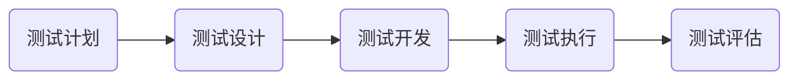
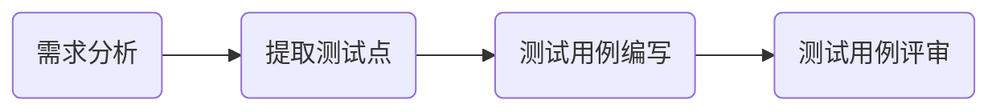

imooc网地址: https://www.imooc.com/video/14410

# 如何写好测试用例

## 第1章 课程介绍

 本门课程会通过模拟一个真实的项目来讲解如何编写测试用例,我们会涉及到需求的分析,测试的方法,测试用例表格的设计,测试用例的编写和评审以及用例的管理几个方面.

#### 前置知识点

##### 软件相关概念

​	  软件是数据、程序、文档的集合, 我们平时的工作测试时就是操作数据,测试的主体就是程序,而文档就是工作时的可视化,测试用例就是文档的一部分

##### 软件测试基础

​	  软件测试就是以满足需求为目的,保证软件质量的一系列手段.我们所做的工作就是为了保证软件的质量,去确定他可以满足用户的需求

##### 测试流程

​	  就是从最开始的需求分析开始,到计划的制定,用例的编写与执行,对测试结果的分析报告,测试流程会指导每一步的工作内容,会告诉我们什么时候应该做什么

##### 测试生命周期

而测试用例的设计与编写就是其中最重要的环节--测试开发

#### 常用术语

##### 黑盒/灰盒/白盒

黑盒/灰盒/白盒测试就是按照软件测试的手段进行划分的三个方向

**黑盒测试**把软件比作一个黑色的盒子,我们不知道盒子里面的内部结构,只能通过外面暴露出来的接口、功能进行测试

**灰盒测试**就是把软件比作一个半透明的盒子,我们可以看到里面少部分的东西,所以我们可以通过外面暴露的功能和盒子内部的数据进行对比,得出测试结论.比如,我们测试一个订单生成的功能,就可以通过软件上生成的订单,和数据库里的数据进行对比,验证是否一致

**白盒测试**就是把软件看作一个透明的盒子,通过观察内部的结构直接推敲出软件是否满足用户的需求,其中白盒测试是这三种测试里面技术难度最高的

##### 功能/性能/安全

是软件测试行业发展的最大的三个专项测试方向,

**功能测试**就是验证软件是否满足用户提出的表面需求, 

**性能测试**就是测试一个软件的工作效率,比如每年的双十一都是对淘宝的一次大型人肉性能测试,去检验淘宝能否满足几亿用户的同时操作

**安全测试**就是测试软件是否能够保护用户的信息不被轻易盗取,不会被一些用心不良的人利用而获取一些非法的利益,比如黑客就是利用安全漏洞以达到其破坏或牟利的意图

##### 兼容性/易用性/UI元素

是测试的测试点划分

兼容性测试是测试软件在不同平台上的表现

易用性测试就是测试软件是否友好,满足用户的使用习惯

UI元素测试就是检查界面的布局显示是否一致美观

## 第2章 测试用例与编写流程介绍

### 2-1 测试用例介绍

测试用例就是我们在测试时使用的一个很重要的文档

#### 测试用例是什么

* 测试工作的核心
* 一组在测试时输入输出的标准
* 软件需求的具体对照

> 我们为什么要这么定义测试用例?

​		因为测试的时候按照测试用例的描述进行操作,它规范了我们每一步的输入和输出,并且给我们对照去判断是否满足需求,而且通过测试用例和需求的一一对照,我们可以确定我们的测试是否能够完全地覆盖需求,是否有遗漏的地方.

#### 测试用例有什么作用

* <u>检验软件是否满足客户需求</u>

  测试用例是通过需求为基础而生成的,通过用例和需求的对照,我们可以方便快捷地知道每一条需求对应的测试用例是什么,如果每条用例都测试通过了,那么需求也就完全通过了

* <u>体现一个测试人员的工作量</u>

  比如上级交代给你一个测试任务,问你需要多长时间能完成测试,如果你有测试用例,那么你就可以根据用例的数量去计算你需要多少时间,比如你一天可以执行50条测试用例,一共有500条,那么你就需要10个工作日;如果你没有测试用例,那么你就只能根据项目的大小去猜了;猜少了,完不成,就只能硬着头皮去加班,猜多了领导会觉得你工作效率低,

* <u>展现测试用例的测试思路</u>

  测试用例是能够体现测试的方法的,通过学习和阅读别人的测试用例,总结别人的方法和思路,对提高自己编写测试用例的水平有很大的帮助

#### 测试用例包含哪些内容

* 用例编号

  每一个编号都是唯一的,如果想要通过下划线的,login_001来添加一个详细的描写

* 用例名称

  ​	  用例名称的要求最少的字言简意赅

* 测试背景

  ​	  测什么东西

* 前置条件

  ​	  注册了的,每组册

* 优先级

  ​	  优先级和重要级没有一定的关系

* 重要级

  ​	  

* 测试数据

  ​	  还是登录功能为例的,因为鼠标的操作也是一种数据

* 测试步骤

  ​	  第一步

* 预期结果

  ​	  比如我输入正确的账号密码

* 实际结果

  ​	  在我们执行测试用例的时候,实际的结果就

* 备注

  ​	  描写一些其他的信息,写上告诉别人

测试用例不是

#### 测试用例编写流程

 

### 2-2 需求分析与测试点编写

## 第3章 测试用例编写,评审与管理

### 3-1 测试用例编写方法

### 3-2 慕课网注册功能测试用例编写

### 3-3 慕课网搜索、APP下载功能测试用例编写

### 3-4 测试用例评审

### 3-5 测试用例管理

## 第4章 课程总结

