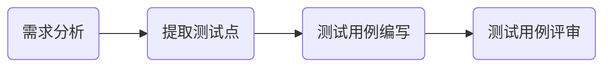

imooc网地址: https://www.imooc.com/video/14410

# 如何写好测试用例

## 第1章 课程介绍

 本门课程会通过模拟一个真实的项目来讲解如何编写测试用例,我们会涉及到需求的分析,测试的方法,测试用例表格的设计,测试用例的编写和评审以及用例的管理几个方面.

#### 前置知识点

##### 软件相关概念

​	  软件是数据、程序、文档的集合, 我们平时的工作测试时就是操作数据,测试的主体就是程序,而文档就是工作时的可视化,测试用例就是文档的一部分

##### 软件测试基础

​	  软件测试就是以满足需求为目的,保证软件质量的一系列手段.我们所做的工作就是为了保证软件的质量,去确定他可以满足用户的需求

##### 测试流程

​	  就是从最开始的需求分析开始,到计划的制定,用例的编写与执行,对测试结果的分析报告,测试流程会指导每一步的工作内容,会告诉我们什么时候应该做什么

##### 测试生命周期

而测试用例的设计与编写就是其中最重要的环节--测试开发

#### 常用术语

##### 黑盒/灰盒/白盒

黑盒/灰盒/白盒测试就是按照软件测试的手段进行划分的三个方向

**黑盒测试**把软件比作一个黑色的盒子,我们不知道盒子里面的内部结构,只能通过外面暴露出来的接口、功能进行测试

**灰盒测试**就是把软件比作一个半透明的盒子,我们可以看到里面少部分的东西,所以我们可以通过外面暴露的功能和盒子内部的数据进行对比,得出测试结论.比如,我们测试一个订单生成的功能,就可以通过软件上生成的订单,和数据库里的数据进行对比,验证是否一致

**白盒测试**就是把软件看作一个透明的盒子,通过观察内部的结构直接推敲出软件是否满足用户的需求,其中白盒测试是这三种测试里面技术难度最高的

##### 功能/性能/安全

是软件测试行业发展的最大的三个专项测试方向,

**功能测试**就是验证软件是否满足用户提出的表面需求, 

**性能测试**就是测试一个软件的工作效率,比如每年的双十一都是对淘宝的一次大型人肉性能测试,去检验淘宝能否满足几亿用户的同时操作

**安全测试**就是测试软件是否能够保护用户的信息不被轻易盗取,不会被一些用心不良的人利用而获取一些非法的利益,比如黑客就是利用安全漏洞以达到其破坏或牟利的意图

##### 兼容性/易用性/UI元素

是测试的测试点划分

兼容性测试是测试软件在不同平台上的表现

易用性测试就是测试软件是否友好,满足用户的使用习惯

UI元素测试就是检查界面的布局显示是否一致美观

## 第2章 测试用例与编写流程介绍

### 2-1 测试用例介绍

测试用例就是我们在测试时使用的一个很重要的文档

#### 测试用例是什么

* 测试工作的核心
* 一组在测试时输入输出的标准
* 软件需求的具体对照

> 我们为什么要这么定义测试用例?

​		因为测试的时候按照测试用例的描述进行操作,它规范了我们每一步的输入和输出,并且给我们对照去判断是否满足需求,而且通过测试用例和需求的一一对照,我们可以确定我们的测试是否能够完全地覆盖需求,是否有遗漏的地方.

#### 测试用例有什么作用

* <u>检验软件是否满足客户需求</u>

  测试用例是通过需求为基础而生成的,通过用例和需求的对照,我们可以方便快捷地知道每一条需求对应的测试用例是什么,如果每条用例都测试通过了,那么需求也就完全通过了

* <u>体现一个测试人员的工作量</u>

  比如上级交代给你一个测试任务,问你需要多长时间能完成测试,如果你有测试用例,那么你就可以根据用例的数量去计算你需要多少时间,比如你一天可以执行50条测试用例,一共有500条,那么你就需要10个工作日;如果你没有测试用例,那么你就只能根据项目的大小去猜了;猜少了,完不成,就只能硬着头皮去加班,猜多了领导会觉得你工作效率低,

* <u>展现测试用例的测试思路</u>

  测试用例是能够体现测试的方法的,通过学习和阅读别人的测试用例,总结别人的方法和思路,对提高自己编写测试用例的水平有很大的帮助

#### 测试用例包含哪些内容

* 用例编号

  ​	  每一个编号都是唯一的,简单的编号可以通过1234来编写,如果想要复杂一些或详细一些的话,可以在前面通过下划线的连接加上一些其他的信息,比如这是一个登录的模块,就可以用login_001这样的形式来添加一个详细的描写

* 用例名称

  ​	  每一条用例都有一个属于自己的名字,用例名称的要求是言简意赅,我们要用最少的字去描述它,而且要描述的准确

* 测试背景

  ​	  就是要说明这个测试用例是一个什么样的用例,它是属于哪个项目的,这条用例主要测什么东西

* 前置条件

  ​	  在执行这条测试之前应该满足什么样的条件,比如要测试登录的功能,那前置条件就是这个账号密码以及注册了的,如果没组册的话我们肯定是登录不上的

* 优先级

* 重要级

  ​	  这两个概念特别容易混淆,很多人以为优先级和重要级是成正比存在的,优先级越高重要级就越高,其实不然,优先级和重要级没有一定的关系.

* 测试数据

  ​	  在测试时输入的数据.还是登录功能为例,我们输入的账号密码就是测试数据;而有的测试数据不需要用键盘输入值,但它也是有测试数据的只是没有明确地写出来,因为鼠标的操作也是一种数据

* 测试步骤

  ​	  测试时应该按照测试步骤里面的描写每一步应该做什么

* 预期结果

  ​	  就是每一步操作对应的现象是什么样子,比如我输入正确的账号密码,点击登录,那么我的预期结果就是登录成功

* 实际结果

  ​	  在我们执行测试的时候,出现的实际的情况.当我正在执行这条用例的时候,我输入了账号密码,点击登录,实际的结果有可能是直接登录成功了,那就没问题,如果是和预期结果不一样,比如登录失败,或者网络异常这种情况,这就说明和预期结果不一致,就说明这个功能有问题,不能满足需求

* 备注

  ​	  描写一些其他的信息,看个人情况.比如一些其他特殊的情况需要在这里写上告诉别人就写在备注里

一个测试用例大概就包括这些内容,根据具体的情况可能还有一些其他的信息,这就要根据具体的情况来具体编写.所以,测试用例不是生搬硬套的,需要根据实际的情况实际来设计编写

#### 测试用例编写流程

### 2-2 需求分析与测试点编写

#### 需求分析

> 什么是需求?

​		需求就是客户需要的东西和对那个东西的要求

一般,需求会从以下三个方面进行入手.

* **业务需求**:<u>关注系统是否满足业务</u>

  ​	  所有的软件都是用以满足客户的业务的,所以,业务需求就是要去分析客户的业务是什么,都有什么样子的流程.是一个购物的业务,还是银行的业务,还是是考勤app这类的业务

* **用户需求**:<u>关注系统是否满足用户习惯</u>

  ​	  需要我们作出的软件是满足用户的使用习惯的,我们要去考虑用户在使用这个软件时的习惯、手感、会不会引起用户的反感之类的.举一个例子,你开发一个app,功能啊业务啊都是满足需求的,但是界面做的超级难看,那用户还会不会去使用呢

* **功能需求**:<u>关注系统是否满足功能要求</u>

  ​	  就是去分析研究软件是否能够满足业务的需求,是否能达到满足业务的目的.

其实,我们作为测试人员,主要是对已有的需求进行分析,我们需要考虑的更多的是怎么验证软件是否满足客户的需求,更深层次的需求分析主要是由产品经理的角色完成的.不过作为软件行业的万金油,当然是各方面知道的越多越好.

<u>**没有需求怎么办?**</u>

​		很多小公司职位不会那么健全,所以是没有产品经理这个岗位专门为各位提供需求的.很可能是直接甩给你一个软件让你开始测试.这种情况我们只需要参考市面上已经上线的同类型的成熟产品,看看别人是怎么做的,我们就怎么做.比如一个电商的系统,我们就去参考淘宝、京东之类的;比如一个点餐的系统,我们就去参考饿了么,百度外卖,美团之类的.

**<u>如果需求模糊怎么办?</u>**

1. 收集整理已有需求
2. 和产品经理逐条确认
3. 参考同类型产品的实现情况

> 我们应该整理好已有的需求,把不明白的地方提出来,逐条的去找相关的负责人确认,比如产品经理、项目经理之类的;或者还是参考同类型产品的实现的情况

我们准备测试的就是慕课网的前端

#### 提取测试点

##### <u>定义</u>

​	  测试点即通过需求分析后对得出的需要进行测试的具体内容

##### 测试点对测试用例的设计有什么好处?

* 快速

  ​	  我们可以根据测试点快速地设计出测试用例

* 覆盖

  ​	  测试点可以完全地覆盖需求

* 方法

  ​	  在测试点上我们可以迅速地运用测试方法

* 细节

  ​	  可以展现出需求的细节

我们选择对登录、注册、app下载还有搜索这几个功能为例子,这几个功能比较典型,在大多数的系统里都会遇到.

创建一个excel表格

| 功能模块 | 测试点编号 | 测试点描述                             |
| -------- | ---------- | -------------------------------------- |
| 注册功能 | 1          | 点击注册按钮显示注册对话框             |
|          | 2          | 对输入的邮箱和手机号进行验证是否可用   |
|          | 3          | 判断验证码是否输入正确                 |
|          | 4          | 点击注册跳转首页                       |
| 登录功能 | 1          | 正常登录                               |
|          | 2          | 判断输入的邮箱手机号是否符合规范       |
|          | 3          | 账号为空时点击登录                     |
|          | 4          | 账号错误时点击登录                     |
|          | 5          | 密码为空时点击登录                     |
|          | 6          | 密码错误时点击登录                     |
|          | 7          | 账号密码都为空时点击登录               |
|          | 8          | 自动登录功能是否有效                   |
|          | 9          | 点击忘记密码跳转到找回密码界面         |
|          | 10         | 使用QQ登录                             |
|          | 11         | 使用微信登录                           |
|          | 12         | 使用微博登录                           |
|          | 13         | 使用慕课网app扫描二维码登录            |
| 搜索功能 | 1          | 输入任意信息点击搜索跳转到搜索结果页面 |
|          | 2          | 在搜索页面输入任意信息可以进行全站检索 |
|          | 3          | 可以筛选搜索的结果                     |
|          | 4          | 可以点击热门搜索进行快捷操作           |
|          | 5          | 点击搜索结果可以跳转到对应的界面       |
|          | 6          | 搜索完成后显示搜到的结果数目           |
| 下载app  | 1          | 鼠标移动到对应图标显示二维码           |
|          | 2          | 扫描二维码可以跳转到下载页面           |
|          | 3          | 点击图标跳转到app介绍页面              |
|          | 4          | app介绍页面包含手机和iPad两个tab键     |
|          | 5          | 点击苹果商店下载跳转到对应的页面       |
|          | 6          | 点击安卓下载直接开始下载app            |
|          | 7          | 点击iPad页面显示app的iPad介绍          |
|          | 8          | 在iPad介绍页面点击下载跳转到对应页面   |

下面根据测试点来进行测试用例的编写

## 第3章 测试用例编写,评审与管理

### 3-1 测试用例编写方法

从本节课开始,我们就根据测试点开始正式地编写测试用例了

##### 编写测试用例的几个注意事项

1. 根据项目的实际情况设计测试用例表格
2. 测试用例的表格不是固定的,不要生搬硬套
3. 测试用例需要根据具体的情况编写

##### 测试用例编写方法

###### 等价类划分法

* 因为测试是无穷无尽的,我们不可能穷尽测试,所以需要使用等价类划分法选择出最具有代表性的数据进行测试

* 如何选择适当的数据子集,来代表整个数据集.

* 通过降低测试的数目去实现“合理的”覆盖,覆盖了更多的可能数据,以发现更多的软件缺陷(这是等价类的作用)

> 什么是等价类划分法
>
> ​	  等价类划分法是一种典型的、重要的黑盒测试方法,它将程序所有可能的输入数据划分成若干个等价类,然后从每个部分中选取最具有代表性的数据当作测试用例进行合理的分类.
>
> 测试用例有有效等价类和无效等价类的代表组成,从而保证测试用例具有完整性和代表性.有效等价类指的是对于程序规格说明来说是合理的,有意义的输入数据构成的集合.利用有效等价类可以检验程序是否满足了程序规格预先规定的功能和性能,有效等价类可以是一个,也可以是多个,根据系统的输入划分成若干个部分,然后从每个部分中选取少数有代表性的数据当作数据测试的测试用例.等价类是输入域的集合,比如登录时的账号必须是邮箱或者手机号,它的有效等价类就是任意一个符合规范的邮箱或手机号,无效等价类和有效等价类正好相反,无效等价类是指对于软件规格而言是没有意义的、不合理的输入数据集合.利用无效等价类可以找出程序异常的情况,检查程序的功能和性能.实现是否不符合规范或者要求的,比如不满足邮箱或手机号的字符串就是无效的等价类

###### 边界值分析法

* 边界值分析法就是对输入或者输出的边界值进行测试的一种黑盒测试方法.边界值可以作为等价类的一个补充,可以让我们更快速的选择出合适的等价类.	  

* 使用边界值分析方法设计测试用例时一般与等价类划分结合起来但它不是从一个等价类中任选一个例子作为代表,而是将测试边界情况作为重点目标,选取正好等于、刚刚大于或刚刚小于边界值的测试数据

比如登录注册时密码的要求是6-16位,等于低于6位或者高于等于16位就是它的边界值

###### 场景法

* 场景法就是我们去分析用户在使用这个软件时会遇到的哪些场景,根据场景来设计测试用例,比如提取的测试点中用户输入账号密码或者不输入账号密码点击登录,这些就是用户使用的场景,这个就要求我们对需求特别熟悉

* 通过运用场景来对系统的功能点或业务流程的描述,从而提高测试效果.场景法一般包含基本流和备用流,从一个流程开始,通过描述经过的路径来确定的流程,经过遍历所有的基本流和备用流来完成整个场景

###### 猜测法

​	  需要我们具备很丰厚的测试经验,依靠直觉去猜测哪些地方容易出现问题,依靠经验去分析哪些场景特别容易被开发忽略从而快速得到测试结果.

### 3-2 慕课网注册功能测试用例编写

根据测试点来进行测试用例的设计,先根据之前课程里讲到的测试用例需要包含的信息,首先来设计测试用例的表格:

重要级和优先级我们可以分为高、中、低三点.

#### 第二个测试点:对输入的邮箱和手机号进行验证是否可用:

​		一般一个测试用例只验证一个功能点,所以这里需要拆开

(使用手机号注册成功:

​		测试步骤和使用邮箱注册成功差不多,但是这里它不需要输入密码,因为它是通过验证码来登录的.

在这里我们只考虑了正常的注册,这里还要考虑异常的信息,就是之前的场景法和等价类参考他们来进行设计.比如注册这里就可以设置**<u>使用错误的邮箱注册失败</u>**,如果注册成功是有效等价类的话,这条用例就是无效等价类

账号的正确和错误我们考虑到了,还有设计的密码不符合规范怎么办.之前在需求分析的时候已经看到了它密码的要求是<u>6~16位密码,区分大小写,不能使用空格</u>(它只要求了6~16位,没要求具体的组合,所以这里就不考虑包含大小写,数字,特殊符号之类的)

密码不符合规范的:

1. 密码小于6位的
2. 密码大于16位的
3. 包含空格

#### 测试点第三点:判断验证码是否输入正确

​		输入正确的情况我们在前面的用例里已经覆盖到了,所以就不单独编写一个用例来判断输入正确的情况,这里只判断它输入错误的情况,所以这里是<u>判断验证码输入错误时不能注册</u>

#### 测试点第四点:点击注册跳转首页

如果是邮箱就应该是跳转到注册成功,提示已发送邮件页面

如果是手机就会跳转到输入手机验证码界面

所以跳转到首页是一个不存在的需求

### 3-3 慕课网搜索、APP下载功能测试用例编写

### 3-4 测试用例评审

### 3-5 测试用例管理

## 第4章 课程总结

