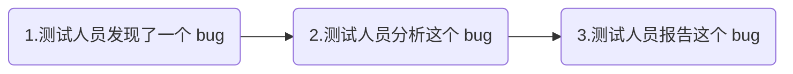
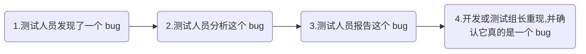
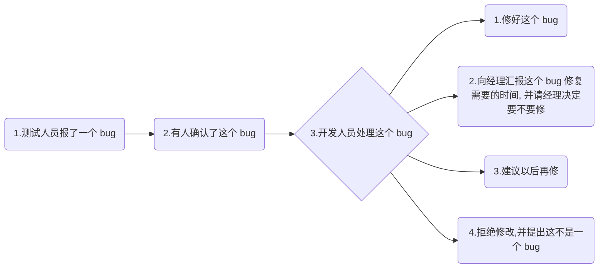
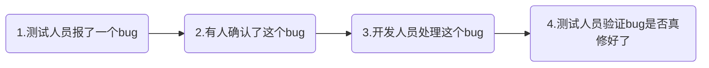

18.010 为什么要写测试理论篇

18.020 软件测试的目标、模型及核心

18.030 软件测试目标的案例1

18.040 软件测试的策略1

18.050 软件测试的策略2

18.060 软件测试的依据1

18.070 软件测试的依据2

18.080 软件测试的依据的案例

18.090 软件测试的不可穷尽性1

18.100 软件测试的不可穷尽性2

## 18.110 Bug 的汇报和处理流程

### 什么是 Bug?

首先, bug 说没有统一的概念的. 再次强调, 不同的人在不同的项目中, 对同一个事物可以有不同的叫法, 对同一个叫法可能有不同的理解, 这必须具体情况具体分析.

可能的 bug 定义有很多, 在特定的语境下, 特定的项目中, 这些定义都对. 当有人跟你讨论 bug 的时候, 你需要询问并理解他们对 bug 的定义, 然后在他们的语境下进行沟通.

一些可能的 bug 定义包括但不限于:

* 与需求文档有矛盾, 或者不符合需求文档的功能.
  * 有可能功能错了, 有可能需求错了, 有可能都错了
* 与其他文档矛盾等, 比如与用户手册不符
* 与设计目标不符的功能
* 与公司标准或规定不符的功能. 比如公司规定用户数据不能由外网访问.
* 与行业标准不符的功能
* 会让公司形象受损, 比如拼错了公司名字或公司 logo
* 与软件的其他模块交互很困难的功能.
* 使软件产生了错误的运行结果的功能.
* 使软件产生了容易引起误解的运行结果的功能. 比如, 显示用户注册成功了, 但其实没成功
* 特别浪费用户时间的功能.
* 任何错误或者说会导致系统报错的功能
* 会导致系统出错的底层错误.
* 任何被发现之后需要修改的功能
* 让用户无法得到他合情合理的预期结果的功能
  * 什么叫合情合理, 有的用户会有一些不合情理的预期, 比如希望抽奖一定能让自己被抽到
* 让其他角色, 比如技术支持人员无法得到他合情合理的预期结果的功能
* 会让人感到头疼的功能

之前的小例子程序:

Input A // 程序接受用户输入的整数并分别保存在A和B两个变量

Input B

Print A/B

然后这个程序就会报错说除数不能为0, 那这个是不是 bug?

有的团队称之为 bug, 有的叫 error, fault, failure, issue, defact, pronto, 问题, 问题单. 

在本教程中, bug 的定义, 我们把任何会导致软件产生不必要的质量问题的东西称为 bug

注意, 不是所有的质量问题都是 bug.

比如, 开车如果撞到墙, 车会被撞破, 这是不是 bug? 这并不是车的 bug, 而是开车撞墙的驾驶员的错, 驾驶员不应该开着车去撞墙, 那么这个是不是质量问题, 可不可以修复呢?...这个例子和我们的软件功能正好可以类比, 软件上有很多功能不是无法实现, 而是实现成本太高了, 这是 bug 吗, 不, 这是质量上的限制或者缺陷, 但是是基于成本的考量而设计成这样的“功能”.

当我们考虑一个问题是不是 bug 的前提是, 我们需要理解质量:

质量是多维度的.

Reliability 可靠性, 这程序可以不出错地运行多久?

Usability 可用性, 用户用起来方便吗?

Maintainability 可维护性, 维护方便吗? 支持蓝绿部署吗?

Testability 可测试性, 好测吗? 页面会不会太动态导致无法自动化?

Functionality/capability 功能性, 这软件能做啥?

Speed 速度, 这程序操作起来卡吗? 慢吗?

Scalability 可伸缩性, 当用户数量暴增时, 服务端可以方便地扩容吗?

Localizability 本地化, 要推出国际版本时, 支持多少语言?

Documentability 文档完善程度, 有帮助文档吗, 有用户手册吗?

Trainability 培训成本, 用起来难吗, 要培训多久能学会?

Technical-supportability 可技术支持性, 比如是否具有完备的日志系统、错误分析流程等

维度有很多, 这就需要测试人员对问题建立系统性思维, 我们更需要具体问题具体分析. 对每个问题是不是 bug, 都要结合项目实际情况来考虑. 而并没有放之四海而皆准的准则来判断一个问题是不是 bug, 需不需要修.

在考虑问题要不要修的时候, 虽然我们主要听领导的, 但测试人员还是要考虑各个角色的看法. 比如:

* 开发
* 运维
* 客服
* 风控
* 产品
* 领导
* 技术支持
* 用户
* 等等

一个问题需不需要修, 不同角色的看法可能不同. 但如果一个 bug 你欲仙知道即使提出来, 所有角色的人都不在意, 那建议不要提. 反过来说, 只要你觉得这些众多角色中哪怕有一个人对这个问题可能认为需要修复, 那就要报出来. 但我们要注意, 这个问题并没有结束, bug 不是报出来就完事了. 为了提高产品质量, 我们希望 bug 尽量被修复掉. 我们先来看看 bug 报上去之后的流程.

### Bug 的汇报和处理流程

#### 最基本的流程

不同的公司, 不同的项目组, 对 bug 的处理往往遵循不同的流程, 但是其中的一些最基本的流程基本上一致, 比如:

#### 加入了 bug 确认的流程

在一些项目组中, 还会有人对 bug 进行确认, 有时甚至有专人负责分配 bug 给对应的开发. 当我在诺基亚工作时, 项目组有一个 test coordinator 的角色, 作为测试协调员, 负责对一些复杂的系统集成问题进行分析, 并与许多 scrum 研发小组协同工作, 寻找问题的根本原因, 并根据其根本原因把问题分配给对应的研发小组. 而我也曾经在一些项目外包的项目中做测试, 此时我并不知道开发是谁, 我们在这种项目做测试时, 往往把发现的 bug 报告给与客户方沟通的中间人, 由他来分配 bug. 另外, 当我在一些 scrum 研发小组内和开发一起工作时, 我发现的 bug 我很清楚应该报给谁, 这种情况, 我可以直接找当事人来确认这个 bug, 并把 bug 分配给他.

当然, 在另外一些项目中, 开发直接来确认这些 bug.

确认的方式: 开发人员需要打开这个 bug 的报告单, 通常在某个 bug 管理系统里, 比如 jira, 禅道, bugfree, bugzilla 等等. 然后阅读测试人员报 bug 时提供的信息, 尝试重现这个 bug.

这里特别要注意两点:

第一点, 如果测试人员写的 bug 描述含糊不清, 开发人员很可能看不懂. 所以只能把 bug 打回给测试, 这将浪费很多时间, 即使你发现的这个 bug 很严重, 但是由于报告写的不清楚, 很可能别人看不出来它很严重.

第二点, 如果测试人员的 bug 描述里没有说明为什么这个问题严重, 那么很可能这个问题会被当作不严重的问题来处理. 而我们有些测试人员特别热衷于测试一些边界值等边边角角的case, 然后让开发去修. 我们真正需要明确的是测试时的优先级, 最高的优先级在于走通主要流程和发现主要的 bug, 而不是去寻找边边角角的小错误. 所以, 当我们报 bug 时, 一定要写清楚这个 bug 为什么重要, 为什么需要修. 边界值如果会导致安全问题, 那么它可以是很重要的 bug, 但有的时候边界值仅仅是一个用户根本不会去输入的值, 这需要具体情况具体分析.

#### 更加完整的流程

在一个 bug 得到确认之后, 需要进行后续处理. 后续处理一般是下图这样的流程. 注意, 在不同的项目中, 开发和测试对 bug 的态度也往往不同, 这往往取决于项目类型、公司类型、绩效考核标准、上级给的压力、心情、习惯、项目截止时间、测试人员地位等等.

值得注意的是, 对 bug 的处理是一个过程, 往往需要测试人员与开发人员共同参与. 测试人员在开发人员研究怎么处理这个 bug 时不能缺席. 我们需要知道, 开发人员对 bug 的处理意见并不一定是最佳方案. 有时候, 开发人员也会选择一些与项目大方向违背的处理方案. 此时, 如果测试缺席, 则项目风险将会加大.

举例, 当项目是由乙方外包人员做, 而测试是甲方公司自己做, 那么 bug 往往会得到修复. 而角色刚好反过来的项目则更可能得到开发“这不是一个 bug” 的反馈. 这是由于外包人员习惯性遵循“不与客户争论”、“按客户说的做”的思路来办事, 外包人员内心深处很容易产生一种“你们想怎么搞我就给你们怎么做, 项目成功失败都与我无关”的想法.

再举个例子, 当项目工期紧且上级给的压力大的时候发现了一个不是十分严重的 bug, 开发人员倾向于“加班修好这个 bug” 而测试人员可能倾向于“建议以后再改”. 因为以后再改会给开发带来一个未来的负担, 开发更倾向于哪怕加班也把事情做掉. 但是, 开发人员并不能准确估计工作量以及这个 bug 会带来的其他风险. 所以, 他们可能为了修复这个 bug 加班到晚上9点, 然后把东西丢给测试自己下班. 测试人员则有与开发不同的视角, 测试人员想的更多的是“我不能漏 bug”, 所以如果 bug 不严重, 测试就不希望开发再做修改. 因为谁知道开发改这个 bug 时会不会引入新 bug 呢, 剩下的时间还够不够把所有的东西再测一遍? 往往是不够的, 即使够, 测试也不想在晚上9点开始加班测试测到半夜.

测试和开发, 对于修不修一个 bug 的观点都在一定程度上受到自己的角色影响. 但现在的项目中, 起主导作用的往往既不是开发也不是测试, 而是领导. 所以这种争论往往需要领导拍板.

当一个 bug 被提交到经理之类的领导那边的时候, 他可能做出以下决定:

* 把 bug 分配给lingerie开发去修
* 给 bug 定一个优先级
* 决定不修这个 bug
* 把 bug 打回并且说“这是一个功能, 不是一个 bug”
* 也可能要求更多关于这个 bug 的信息, 比如 bug 的重现频率, bug 影响哪些模块, 如果修需要多长时间等等.

测试人员要特别注意其中的优先级. 有很多测试人员往往会自行决定这个 bug 优先级高, 那个 bug 优先级低. 但这种判断的依据在哪里? 优先级应该由项目管理人员来决定. 测试人员可以说“这个 bug 很严重”, 但到底要不要优先修复, 这需要从整个项目的角度由领导决定, 而非简单地根据 bug 严不严重来决定要不要先修.

从技术角度来看, 一个 bug 的修复优先级, 往往也与他严不严重没有必然关系.我们来看一个例子: 当我们在一个功能模块上发现了一个重大 bug 和几个轻微 bug 时, 有可能把这几个 bug 一起修复掉会比较好, 而先修复重大 bug 然后在后面的迭代中来慢慢修复这几个轻微 bug 并不是一种很好的做法. 因为这意味着开发需要一遍又一遍地修改这个模块, 每次修改, 测试人员都要去验证有没有引入新 bug. 因此, 轻微的 bug 也可能得到较高的优先级来优先修复.

再举一个严重 bug 也不修复的例子, 并不是说 bug 严重就一定会优先修复. 当我们遇到一个严重 bug, 修复这个 bug 需要巨大成本, 比如可能导致其他更多的重要功能受到影响时, 我们宁可砍掉这个功能, 等下一个版本再发布这个功能. 此时, 严重的 bug 仍然得到了一个较低的优先级.

#### 当 bug 得到修复之后的流程

开发修复 bug 之后, 测试人员需要对 bug 进行验证. 此时的验证应该包括:

* 这个 bug 修好没修好?

  有时开发理解错了, 根本没修, 还把另外的功能改错了

  有时开发在一些模块上修复了这个 bug, 但是另外一些模块上没修复

* 修这个 bug 有没有导致一些其他副作用, 或者引入新 bug?

  有时为了修一个 bug, 开发想了一个很神奇的机制, 而这个神奇的机制本身会导致另外一些功能受到影响. 注意, 开发的大多数神奇的机制、奇妙的想法都很值得测试人员深入挖掘它的副作用. 有时在修复一个 bug 时, 开发无意识地引入了新的 bug.

* 这个 bug 的根本原因解决了吗, 还是开发仅仅做了一个 work around 来绕过了问题

  PS: work around 指不从根本原因上修复 bug, 而是想了一个其他方法绕过 bug. 比如, 服务器磁盘空间不足的 bug, 从根本原因上解决, 需要找到大量占用磁盘空间的原因是什么, 并评估这样的占用是否正常, 对不正常的地方进行修复, 然后建立一套科学的磁盘空间清理机制, 甚至外挂一些额外的磁盘. 而绕过这个 bug 只需要登录服务器删除一些大文件, 让此时的磁盘空间占用率下降一点, 表面上看修好了, 实际上再过一两天又复发.

#### 最后的流程

在验证 bug 被修复后, 根据项目组的要求, 测试人员可能需要关闭 bug, 并在以后用 bug 管理系统来出一些报表, 比如“release 1.0 的 bug 报表”、“最近3个 release 的 bug 数量变化” 等. 有些项目组会要求测试人员在关闭 bug 时注明在什么环境什么版本上验证过 bug, 并附上相关报告或日志. 这也取决于项目组的要求. 事实上整个 bug 的报告和处理流程都是取决于项目组的要求. 如果你是项目组唯一的测试人员, 并且需要你来构建 bug 的处理流程, 那么你可以参考上面提过的流程, 选择一个你的项目组成员容易接受的, 不太复杂的流程, 来作为你们的 bug 处理流程.

18.120 Bug 的汇报原则与案例

18.130 错误的实现和「目标-差异」思想

18.140 错误的设计和缺失的设计

18.150 测试计划和测试用例

18.160 测试设计的现代方法

